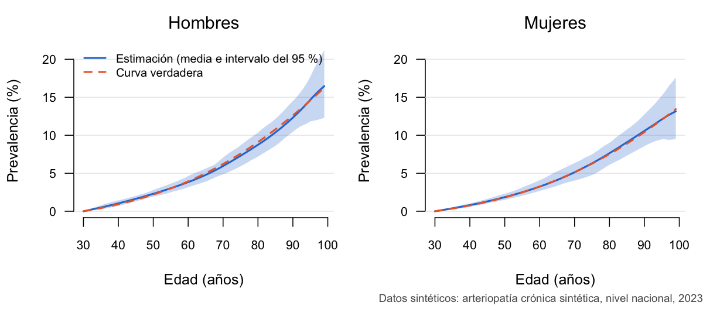

<!-- README.md se genera desde README.Rmd: edita README.Rmd y vuelve a generarlo con
     rmarkdown::render("README.Rmd", output_format = "github_document"). -->

# dismodlite 

<!-- badges: start -->

[](https://github.com/horaciochacon/dismodlite/actions/workflows/R-CMD-check.yaml)
[](https://horaciochacon.github.io/dismodlite/)
[](https://opensource.org/licenses/MIT)
<!-- badges: end -->

Estimación de la carga de una enfermedad por edad, sexo y ubicación, con
un modelo enfermedad-muerte, en R.

## ¿Qué hace?

dismodlite estima la prevalencia, la incidencia, la mortalidad en exceso
y los años vividos con discapacidad (AVD) de una enfermedad, por edad y
sexo, en un país y en sus ubicaciones subnacionales (departamentos,
regiones, provincias…). Parte de una estimación de referencia ya
publicada, el **ancla** (por ejemplo, la del estudio de la Carga Global
de Enfermedad, GBD), y la combina con los datos locales que haya
mediante un modelo enfermedad-muerte ajustado por MCMC. Lleva el
resultado nacional a las ubicaciones subnacionales con covariables,
calcula los AVD con una tabla de severidad y propaga la incertidumbre de
cada paso con simulaciones. Cada corrida queda en una carpeta
reproducible, con un manifiesto que registra sus insumos, sus decisiones
y los valores tomados por defecto.

## Instalación

``` r
install.packages("remotes")
remotes::install_github("horaciochacon/dismodlite")
```

Hace falta R 4.1 o posterior, en Windows, macOS o Linux. Las pruebas
automáticas del paquete usan la versión actual de R en los tres sistemas
y, en Linux, también la versión en desarrollo, la anterior y la 4.1. Un
compilador de C++ es opcional: solo lo usa el motor `"rcpp"`, una
versión más rápida del ajuste (requiere el paquete Rcpp y, en Windows,
Rtools). Sin compilador todo funciona con el motor por defecto, `"mh"`,
escrito en R.

## Cómo se usa: tres comandos

Un proyecto es una configuración corta (`config.yaml`) y unas pocas
tablas, el **contrato de insumos**: las ubicaciones, la población y el
ancla (las descargas de GBD Results, tal como se descargan) y, si los
hay, las covariables y sus efectos, los datos locales y la severidad.
Todas comparten las mismas columnas de causa, ubicación, año, sexo y
edad, y van en una carpeta o se pasan como `data.frame` de R.

``` r
library(dismodlite)

# 1. Crear la carpeta del proyecto: la configuración comentada y las plantillas de las tablas
dl_nuevo_proyecto("mi_proyecto", causa = 1234, nombre = "Mi enfermedad", anio = 2023, edad_inicio = 30)
# ... llenar ubicaciones.csv, poblacion.csv y severidad.csv y poner las descargas en ancla/ ...

# 2. Revisar todo antes de correr: una línea por comprobación, con la corrección sugerida
dl_revisar_proyecto("mi_proyecto")

# 3. Correr: insumos, ajuste, estimación subnacional, AVD, diagnósticos y carpeta de la corrida
dl_correr("mi_proyecto", semilla = 1, rapido = TRUE)  # una prueba corta, de principio a fin
dl_correr("mi_proyecto", semilla = 1)                 # la corrida de producción
```

Las tablas también se pueden pasar desde R, sin carpeta:

``` r
p <- dl_proyecto(configuracion = list(causa = 1234, anio = 2023, edad_inicio = 30),
                 ubicaciones = mis_ubicaciones, poblacion = mi_poblacion, ancla = "descargas/gbd_2023.csv",
                 severidad = mi_severidad)
dl_revisar_proyecto(p)
dl_correr(p, semilla = 1)
```

La guía [Preparar tus
datos](https://horaciochacon.github.io/dismodlite/articles/preparar-datos.html)
describe cada tabla, sus columnas y sus unidades, y de dónde suele
salir; `?dl_tablas` es la referencia completa.

## Ejemplo mínimo

El paquete trae un proyecto de ejemplo completo, `dl_ejemplo()`. Todos
sus números son **sintéticos**: la enfermedad es inventada (la
*arteriopatía crónica sintética*, causa 9100) y la geografía es la de un
país real (Perú, con sus 25 departamentos como ubicaciones
subnacionales), sin ningún dato real. Como las curvas verdaderas se
conocen, se puede comprobar si el modelo las recupera.

``` r
library(dismodlite)
dl_revisar_proyecto(dl_ejemplo(), causa = 9100)
#> Revisión del proyecto «acs_peru», causa 9100
#>   ✓ ubicaciones: leída: 26 fila(s)
#>   ✓ poblacion: leída: 2100 fila(s)
#>   ✓ ancla: leída: 768 fila(s) (descarga de GBD Results)
#>   ✓ covariables: leída: 1508 fila(s) (descarga de covariables del GHDx)
#>   ✓ betas: leída: 3 fila(s)
#>   ✓ datos: leída: 185 fila(s)
#>   ✓ severidad: leída: 12 fila(s)
#>   ✓ configuración: config/9100.yaml: proyecto
#>   ✓ proyecto: las reglas entre tablas se cumplen
#>   ✓ insumos: dl_insumos() los arma y los valida (hash 1e144edebc72)
#> Todo en orden.
```

Un ajuste nacional corto y sus estimaciones por edad y sexo:

``` r
proyecto <- dl_proyecto(dl_ejemplo(), causa = 9100)
insumos <- dl_insumos(proyecto)
opciones <- dl_opciones_mcmc(simulaciones = 100, cadenas = 2, iteraciones = 2000, calentamiento = 1000)
ajuste <- dl_ajustar(insumos, opciones, semilla = 1)
estimaciones <- dl_estimaciones(ajuste)
head(estimaciones)
#>    location_id sex_id  edad      medida        media     inferior    superior
#>         <char>  <int> <int>      <char>        <num>        <num>       <num>
#> 1:         123      1    30 prevalencia 0.0000000000 0.0000000000 0.000000000
#> 2:         123      1    31 prevalencia 0.0009713892 0.0004834718 0.001674911
#> 3:         123      1    32 prevalencia 0.0019514261 0.0010106230 0.003300012
#> 4:         123      1    33 prevalencia 0.0029423464 0.0015789707 0.004877413
#> 5:         123      1    34 prevalencia 0.0039464232 0.0021877604 0.006410696
#> 6:         123      1    35 prevalencia 0.0049659840 0.0028435334 0.007903400
```



Son las cadenas cortas de `dl_correr(rapido = TRUE)`, para que el
ejemplo corra en segundos: sirven para probar, no para publicar.
`dl_correr()` usa por defecto las de producción (1000 simulaciones, 4
cadenas de 50 000 iteraciones). La guía [Primeros
pasos](https://horaciochacon.github.io/dismodlite/articles/primeros-pasos.html)
recorre este ejemplo paso a paso, con el código de la figura.

## Guías y referencia

En el [sitio del paquete](https://horaciochacon.github.io/dismodlite/):

- las [guías](https://horaciochacon.github.io/dismodlite/articles/):
  para empezar, el proyecto de ejemplo, el modelo y cómo preparar los
  datos de un proyecto propio; después, una guía por tema (la estimación
  subnacional, los datos locales, los subtipos, los AVD, las corridas y
  el diagnóstico);
- la
  [referencia](https://horaciochacon.github.io/dismodlite/reference/):
  la ayuda de cada función, ordenada por etapa. Cada etapa de una
  corrida es una función que se puede llamar por separado; `?dl_correr`
  las lista en orden.

## Cómo citar

``` r
citation("dismodlite")
```

## Licencia

El código es MIT. Ver [LICENSE.md](LICENSE.md).

Los catálogos de GBD 2023 que trae el paquete (estados de salud con sus
pesos de discapacidad, y secuelas, en
`inst/referencia/catalogo_*_gbd2023.csv`) son datos del Institute for
Health Metrics and Evaluation (IHME) y se rigen por sus propios términos
de uso (uso no comercial con atribución), no por la licencia MIT: ver
`inst/referencia/LEEME_catalogos.md`, con su cita.

## Problemas y sugerencias

Informa de un error o propón una mejora en
[github.com/horaciochacon/dismodlite/issues](https://github.com/horaciochacon/dismodlite/issues).
Si es un error, incluye el mensaje completo y, si puedes, la salida de
`dl_revisar_proyecto()` de tu proyecto.
